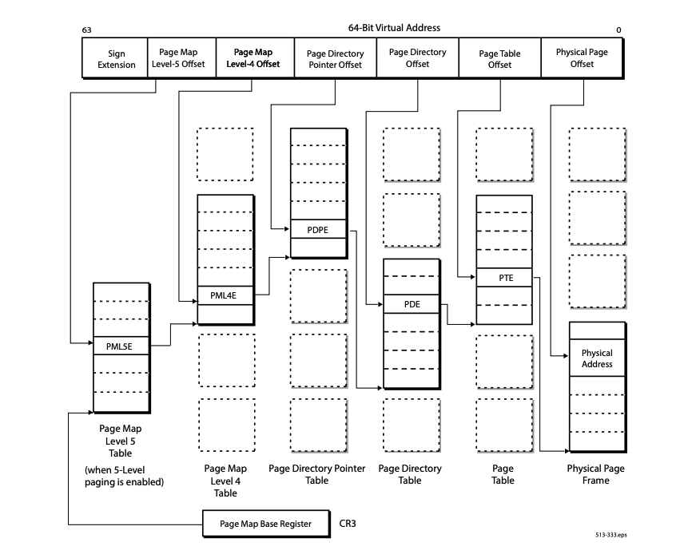

# KVM Hypervisor

This project implements a **minimal x86-64 hypervisor** in **C/C++** using the Linux [**Kernel-based Virtual Machine (KVM) API**](https://docs.kernel.org/virt/kvm/api.html). It creates and runs one or more virtual machines, configures each guest for 64-bit long mode, and handles guest-host communication through explicit I/O port protocols.

Beyond basic VM execution, the hypervisor provides guest file operations, per-VM file isolation with copy-on-write support for shared files, and interrupt-driven communication between multiple virtual machines through a synchronized shared buffer.

> The primary motivation behind this project was to gain practical experience with **hardware-assisted virtualization** and better understand how guest code, the hypervisor, and the Linux KVM subsystem interact. Developing the hypervisor involved configuring x86-64 processor state and page tables, handling KVM exits, designing guest-host communication protocols, and coordinating multiple virtual machines using POSIX threads and interrupts.
>
> This project was developed as a [university assignment](instructions.pdf) for the "Computer Architecture and Organization 2" course at the University of Belgrade School of Electrical Engineering. Please refer to the file for the complete assignment specification.

## Table of Contents

- [System Overview](#system-overview)
  - [Architecture](#architecture)
  - [Execution Flow](#execution-flow)
- [Guest-Host Communication](#guest-host-communication)
- [File System Support](#file-system-support)
  - [Guest File API](#guest-file-api)
  - [File Isolation and Copy-on-Write](#file-isolation-and-copy-on-write)
- [Shared Buffer and Interrupts](#shared-buffer-and-interrupts)
- [Building and Running](#building-and-running)
  - [Prerequisites](#prerequisites)
  - [Build](#build)
  - [Command-Line Options](#command-line-options)
  - [Run](#run)
- [Testing](#testing)
- [Assignment Reference](#assignment-reference)

## System Overview

### Architecture

The project is divided into host, guest, and shared protocol components:

| Component | Responsibility |
|-----------|----------------|
| **Host hypervisor** | Creates KVM virtual machines and vCPUs, maps guest memory, configures long mode, loads guest images, handles VM exits, and coordinates all VMs. |
| **Guest image** | Runs as freestanding 64-bit code, initializes its GDT and IDT, performs file operations, communicates through I/O ports, and terminates with `hlt`. |
| **Common protocols** | Define the binary request formats, I/O ports, operation codes, and constants shared by host and guest code. |
| **Shared state** | Synchronizes console access, shared files, and the interrupt-driven buffer used for inter-VM communication. |

Each guest is assigned its own KVM virtual machine, single virtual CPU, guest memory region, descriptor table, and POSIX thread. State that must be visible to every VM is stored separately and protected with mutexes and condition variables.

Guest physical memory is identity-mapped and supports either **4 KiB pages** or **2 MiB huge pages**. Page tables are stored below address `0x8000`, while the raw guest image is loaded at `0x8000` and the initial stack pointer is placed at the top of guest memory.

The project uses four-level paging; the optional Page Map Level 5 is not enabled. With 4 KiB pages, address translation proceeds through the PML4, PDPT, Page Directory, and Page Table, while 2 MiB pages are mapped directly by Page Directory entries. For a practical overview of the required paging structures, refer to [Setting Up Long Mode](https://wiki.osdev.org/Setting_Up_Long_Mode).

<p align="center">
  
</p>

<p align="center">
  <sub>64-bit virtual address translation. Source: <a href="https://docs.amd.com/v/u/en-US/24593_3.45_APM_Vol2_PUB">AMD64 Architecture Programmer's Manual, Volume 2: System Programming</a>.</sub>
</p>

### Execution Flow

1. The hypervisor parses and validates the command-line configuration.
2. One POSIX thread and one KVM virtual machine are created for each guest image.
3. Guest physical memory is allocated and registered with KVM.
4. Long mode, paging, segment registers, instruction pointer, and stack pointer are configured.
5. The guest runs through `KVM_RUN` until an I/O operation, interrupt window, halt, shutdown, or unexpected exit occurs.
6. The host handles the exit and resumes the guest, or reports the failure and stops the VM.

## Guest-Host Communication

The guest communicates with the userspace hypervisor through x86 `IN` and `OUT` instructions. KVM converts these operations into `KVM_EXIT_IO` exits, which are processed by the host.

| Port | Data Size | Purpose |
|------|-----------|---------|
| `0xE9` | 1 byte | Serial input and output |
| `0x278` | 4 bytes | File request address and operation result |
| `0x510` | 1 or 4 bytes | VM mode, shared-buffer size, and buffer data |
| `0x520` | 4 bytes | Final transferred-byte count and reader acknowledgment |

The host validates the port, direction, data size, request layout, and every guest-memory range before reading or writing guest data.

## File System Support

### Guest File API

The guest exposes a small POSIX-like file interface:

| Function | Description |
|----------|-------------|
| `int open(const char *path, int flags)` | Opens or creates a file and returns a guest-local descriptor. |
| `int close(int fd)` | Closes an open guest descriptor. |
| `int read(int fd, char *buf, int count)` | Reads file data directly into validated guest memory. |
| `int write(int fd, const char *buf, int count)` | Writes data from validated guest memory. |
| `int lseek(int fd, int offset, int off_flag)` | Moves the file position to an absolute offset or to the end of the file. |

Supported open flags:

| Flag | Value | Description |
|------|-------|-------------|
| `O_RD` | `1` | Open for reading |
| `O_WR` | `2` | Open for writing |
| `O_RDWR` | `4` | Open for reading and writing |
| `O_CREATE` | `8` | Create the file if it does not exist |

`lseek` supports `SEEK_SET` and `SEEK_END`. Guest file names may contain letters, digits, and dots, but must start with a letter and may not exceed 255 characters.

### File Isolation and Copy-on-Write

Local guest files are stored under:

```text
vm_files/vm_<id>/
```

Each VM owns a separate guest descriptor table, so descriptors and local files are not shared implicitly between guests.

Files supplied through `-f` or `--file` are initially shared by their base name and opened from their original host path. When a VM performs the first write to a shared file, the hypervisor:

1. Creates a private copy inside that VM's local directory.
2. Preserves the current offset of every matching open descriptor.
3. Reopens those descriptors against the private copy.
4. Continues all later operations without modifying the original shared file or another VM's view.

## Shared Buffer and Interrupts

The hypervisor uses interrupt vector **32**, the first vector available for external or software-injected interrupts, since vectors `0-31` are reserved for CPU exceptions. You can read more about x86 interrupt vectors and the Interrupt Descriptor Table [here](https://wiki.osdev.org/Interrupt_Descriptor_Table).

Together with a shared 256-byte buffer, this interrupt mechanism coordinates communication between VMs. The first VM is assigned the **writer** role, while every remaining VM is assigned the **reader** role.

Two interrupts are injected into every guest:

1. The first interrupt delivers the VM role through port `0x510`.
2. The second interrupt starts the shared-buffer transfer.

The writer first sends the requested byte count and then the data. The hypervisor consumes the complete transfer but stores at most `BUFFER_SIZE` bytes. Each reader receives the stored byte count and data, then acknowledges the exact number of bytes through port `0x520`.

The writer does not finish its round until all readers have acknowledged the same buffer generation. Mutexes and condition variables ensure that a new write cannot begin while readers are still processing the current data.

The included guest demonstrates the complete flow by reading `guest.txt` into the shared buffer on the writer VM and saving the received data as `reader.txt` on reader VMs.

## Building and Running

### Prerequisites

The hypervisor must be built and run on a **Linux x86-64 host** with:

- A processor with Intel VT-x or AMD-V virtualization support
- KVM enabled in the Linux kernel
- Read and write access to `/dev/kvm`
- GCC and G++ with C++17 support
- GNU Make and GNU Binutils (`ld`)
- POSIX threads, normally provided by glibc

You can verify KVM access with:

```bash
test -r /dev/kvm && test -w /dev/kvm && echo "KVM is available"
```

> [!IMPORTANT]
> KVM is a Linux kernel interface. The hypervisor cannot run natively on macOS or Windows. A Linux machine or a Linux VM with nested virtualization enabled is required.

### Build

Clone the repository:

```bash
git clone https://github.com/JovanMosurovic/kvm-hypervisor.git
cd kvm-hypervisor
```

Build the host hypervisor and the default guest image:

```bash
make -C host
make -C guest
```

Optional incremental test guests can be built separately:

```bash
make -C tests
```

The main build artifacts are:

```text
host/build/hypervisor
guest/build/guest.img
tests/build/A/*.img
tests/build/B/*.img
```

### Command-Line Options

| Option | Accepted Values | Description |
|--------|-----------------|-------------|
| `-m`, `--memory` | `2`, `4`, `8` | Guest memory size in MiB |
| `-p`, `--page` | `4`, `2` | Page size: `4` selects 4 KiB, `2` selects 2 MiB |
| `-g`, `--guest` | One or more paths | Raw guest image paths; one VM is created per image |
| `-f`, `--file` | One or more paths | Optional host files shared with all VMs by base name |
| `-h`, `--help` | - | Prints the usage summary |

The memory, page, and guest options are required. Supplying an option more than once, using an unsupported value, or passing an unknown argument stops execution before any VM is started.

### Run

Run two copies of the default guest to demonstrate the writer/reader shared-buffer flow:

```bash
printf 'AB' | ./host/build/hypervisor \
  --memory 4 \
  --page 4 \
  --guest guest/build/guest.img guest/build/guest.img
```

In this example:

- Both guests receive 4 MiB of physical memory and use 4 KiB pages.
- VM 0 writes data to the shared buffer.
- VM 1 reads the data and stores it in `vm_files/vm_1/reader.txt`.
- `A` and `B` provide the one-byte serial inputs requested by the two guest instances.

Shared host files can be supplied with `-f` or `--file`:

```bash
./host/build/hypervisor \
  -m 4 \
  -p 2 \
  -g guest1.img guest2.img \
  -f shared.txt
```

## Testing

The `tests` directory contains small freestanding guest programs organized by project phase:

- **A1** - Serial output and termination with `hlt`
- **A2** - One-byte serial input and echo through port `0xE9`
- **B1** - File creation, write, close, reopen, and read
- **B2** - Open-flag validation and read/write access in one session
- **B3** - Shared-file isolation and copy-on-write behavior with separate reader and writer guests

These stage-specific guest images test isolated functionality and do not complete the final shared-buffer workflow.

The default guest under `guest/src` additionally exercises the final interrupt and shared-buffer communication flow. The final hypervisor considers a VM successful only after that transfer is completed and the guest exits with `hlt`.

## Assignment Reference

Course: **Computer Architecture and Organization 2 ([13S113AOR2](https://www.etf.bg.ac.rs/fis/karton_predmeta/13S113AOR2-2013))**  
Academic Year: **2025/2026**  
University of Belgrade, School of Electrical Engineering  
Major: Software Engineering

The assignment is divided into three phases:

- **Phase A** - Basic KVM execution, memory and page configuration, serial I/O, and multi-VM threading
- **Phase B** - Guest file operations, isolated local files, shared files, and copy-on-write behavior
- **Phase C** - Interrupt injection and synchronized communication between virtual machines through a shared buffer

For complete requirements, constraints, and grading details, refer to [instructions.pdf](instructions.pdf).
